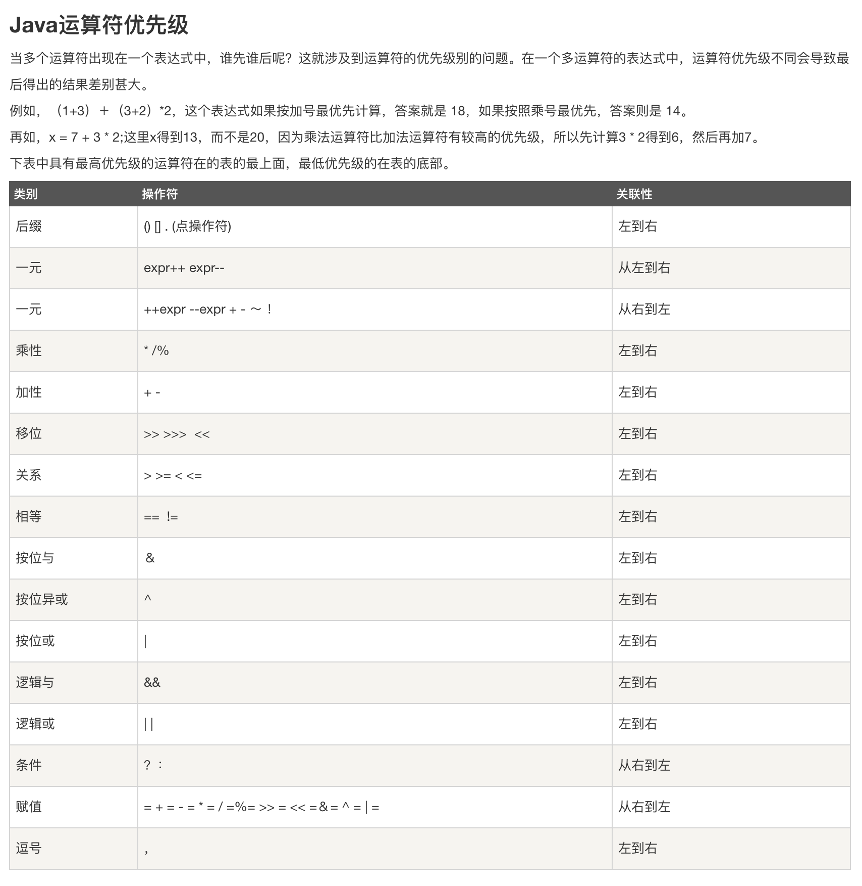

# 操作符
[3.1](#1) | [3.2](#2) | [3.3](#3)

### <span id = "1">3.1 更简单的语句</span>
* N/A
### <span id = "2">3.2 使用Java操作符</span>
* 几乎所有的操作符都只能作用于 **基本数据类型**, 例外: "=", "==", "!=", 这些操作符也可以作用于 **对象数据类型**
* String类支持 "+"(字符串拼接) 和 "+=";
    ```Java
    class Main {
        public static void main(String[] args) {
            String a = "johnny";
            String b = "hello ";
            int c = 66;
            System.out.println(b + a);  //hello johnny
            System.out.println(a + c);  //johnny66
        }
    }
    ```
### <span id = "3">3.3 优先级</span>
* 
